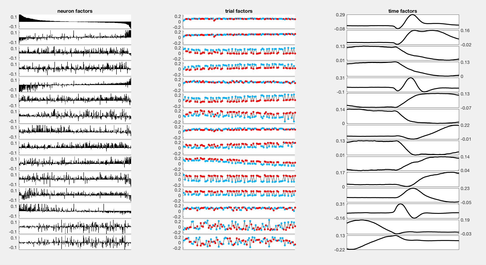

# Tensor decompositions of trial-structured calcium imaging datasets

## Background material

A *tensor* is a higher-order numeric array. The *order* of a tensor is the number of indices/dimensions it holds. In MATLAB, `randn(10,10,10)` creates a tensor of order 3.

There are many tensor decompositions one can try, but the simplest and easiest to interpret is the canonical polyadic decomposition (CPD). We will focus on fitting this decomposition on an order-3 tensor `neurons x intra-trial phase x trials`, which gives us three sets of low-dimensional factors/components. The first set of components provides a low-dimensional representation of the neurons, the second set of components provide a representation of the within-trial dynamics of the neurons, and the final set of components provide a representation of how the within-trial dynamics change across trials and days.

[Kolda & Bader (2008)](http://dx.doi.org/10.1137/07070111X) is a good review that covers the more technical details of tensor decomposition.

## Basic Walkthrough

Start by loading data and turning it into a `MultiDay` object named `md`. Refer to `docs/ds_quickstart.md` and `docs/md_quickstart.md`.

The decomposition can take moderately long to fit when taking data from multiple days (particularly the scree plot, explained below) -- it is probably a good idea to start with just one day.
The sections below walks through the demo script and provides brief explanations of each of the generated plots:

#### Converting a `MultiDay` object to a data tensor

The first step is to export data from the `MultiDay` object:

```matlab
[X, meta, neuron_map, trial_map] = export(md);
```

`X` is a cell array holding the neural activity on each trial. Each entry in the cell array is a matrix with `N` rows and a variable number of columns (depending on the number of frames captured on each trial). *The neurons are matched across all trials* (e.g. the first row in all matrices is the trace corresponding to the same neuron).

`meta` is a struct array holding the metadata for each trial. For example, `meta.start` is a cell array holding the start location of each trial.

`neuron_map` and `trial_map` are matrices that match the trials and neurons in `X` back to the original multiday object.

The `export` function (which lives in `ds/@MultiDay/MultiDay.m`) provides options to filter the trials that are exported. For example, the following will filter out any probe trials (i.e. trials starting in the north or south arms):

```matlab
[X, meta, neuron_map, trial_map] = export(md, 'start', {'east','west'});
```

You can also constrain the data to the first or second half of each trial. For example,

```matlab
[X, meta, neuron_map, trial_map] = export(md, 'extent', 'first');
```

Truncates the data for each trial once the mouse moves out of the starting arm.

#### Warping the trials to a common length

Before fitting tensor decompositions, we need to convert `X` from the cell array format to a 3-dimensional array. This is achieved by:

```matlab
>> X = timewarp(X)
```

At the moment, we just do linear interpolation/stretching to convert all trials to the same length. In the future I want this function to support other options - in particular, approaches based on dynamic time warping or aligning the activity traces to the mouse position.

#### Normalizing/Standardizing data

From day-to-day there appears to be significant fluctuations in the mean fluorescence of each cell. This can pollute the results of the CP decomposition, so it is useful to mean-subtract within each cell for each day. This is done by:

```matlab
>> X = normalize_tensor(X, meta);
```

In pseudocode, this computes:

```
for each neuron
  for each day
    X[neuron,:,day] -= mean(X[neuron,:,day])
  end
end
```

#### Fitting the CPD model and making a scree plot

Tensor decompositions are non-convex optimization problems and are NP-hard in terms of worst case analysis.
Thus, it is prudent to fit the model with multiple random initializations.
We would like to get a sense of how well fit the model is to the data as a function of model complexity (i.e. we need to determine how many factors to fit to the data).
To do this, we use the `fit_cpd` function:

```matlab
[cpd_list, rsq] = fit_cpd(X, 'min_rank', 1, 'max_rank', 15, 'num_starts', 10)
```

This will fit models from 1 factor up to 15 factors, and fit each model from 10 different random initializations.
(In practice, I've reassuringly observed that different initializations produce similar models.)
The results are returned in a 1-dimensional struct array `cpd_list` which holds the outcome of each optimization.
The vector `rsq` holds the coefficient of determination (R<sup>2</sup>) for each optimzation as a measure of the fit.
These results are commonly summarized with a [scree plot](http://support.minitab.com/en-us/minitab/17/topic-library/modeling-statistics/multivariate/principal-components-and-factor-analysis/what-is-a-scree-plot/).
The following command will produce a nicely formatted scree plot, given the struct array of cpd fits:

```matlab
visualize_rank(cpd_list);
```


#### Visualizing the factors

Typically, we will just pick the model with the highest R<sup>2</sup> to analyze further:

```matlab
[~,best_idx] = max(rsq);
cpd = cpd_list(best_idx);
```

Next, let's visualize the factors. Each factor is a triplet of three vectors, and the number of factors is the *rank* of the model.
Below, I visualized the factors for a rank 15 model using the command:

```matlab
visualize_neuron_ktensor(cpd.decomp, meta, 'start')
```



The left column of plots shows the 15 *neuron factors*.
Because the ordering of the neurons in the data tensor `X` isn't especially meaningful, I've sorted the neurons from highest to lowest on the first factor (i.e the top plot).
The second colum of plots shows the 15 *within trial factors*.
The third column of plots shows the 15 *across trial factors*, with the east and west starts colored in blue and red respectively.

You can change the coloring of the across trial factors (right column) by inputting a string that matches one of the fieldnames in the `meta` struct:

```matlab
visualize_neuron_ktensor(cpd.decomp, meta, 'correct') % colors correct vs incorrect trials
visualize_neuron_ktensor(cpd.decomp, meta, 'day') % colors by session
visualize_neuron_ktensor(cpd.decomp, meta, 'strategy') % colors by inferred navigation strategy
```

#### Visualizing the model fit

It is useful to view the model's prediction and the raw data on the same plot, this can be done with the following commands:

```matlab
% get the full reconstructed tensor from the model
Xest = full(cpd.decomp);
Xest = Xest.data;

% plot fit across neurons
visualize_fit(X,Xest,1,md,trial_map);
```

The last command should produce a series of plots that look like this (press the space button to go to the next plot and `Control-C` / `Command-C` to interrupt the program).


This figure plots a single neuron `X(i,:,:)` on 25 random trials.
The raw data is plotted in red/blue traces respectively denoting east/west trial starts.
The model fit is the black trace in all plots.

It is also possible to examine the model fit across all trials, i.e. examining slices through the third mode of the tensor `X(:,:,i)`.

```matlab
% plot fit across trials
visualize_fit(X,Xest,3,md,trial_map);
```


#### Visualizing the residuals and outlier detection

Another question of interest is whether the model is better fit to some trials or to some neurons more than others.
To look at this we examine the residuals for each neuron, trial phase, and trial (`X(n,t,k) - Xest(n,t,k)`) as well as the squared error `(X(n,t,k) - Xest(n,t,k))^2`.

```matlab
% plot fit across trials
visualize_resids(X,Xest,md,trial_map);
```

Produces a plot like:


## Non-negative Decompositions

Just as [non-negative matrix factorization (NMF)](https://en.wikipedia.org/wiki/Non-negative_matrix_factorization) extends PCA by constraining the loadings/components to be non-negative, we can try fitting non-negative tensor decompositions. The `fit_cpd` contains an option to do this:

```matlab
[cpd_list,rsq] = fit_cpd(Xnrn, 'nonneg', true); % fits 10 non-neg rank 15 cp models
```

Everything else should work as described in the previous section. For example, `visualize_neuron_ktensor` can produce something that looks like this:


